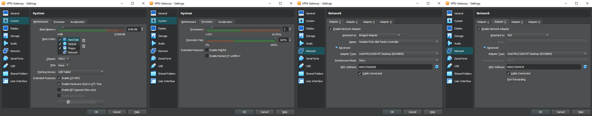

# VPN Gateway – Network Bridge Node Setup

## ⚙️ Configuration Summary:
- OS: Ubuntu Server 24.04 (64-bit)
- Username: `vpnadmin`
- Password: `vpn1234` (intentionally weak for brute-force testing)
- Hostname: `VPN-Gateway.vpnadmin.virtualbox.org`
- RAM: 2048 MB (2 GB)
- CPU: 2 cores
- Disk: 20 GB (dynamically allocated)
- Chipset: PIIX3
- EFI: Disabled
- Guest Additions: Not installed

## 🌐 Network Configuration:
**Adapter 1 (External)**
- Type: Bridged Adapter  
- Interface: Realtek PCIe GbE  
- MAC: `08002766D6E`  
- Role: External access (e.g. SSH bruteforce entry point)

**Adapter 2 (Internal)**
- Type: NAT  
- MAC: `08002768467E`  
- Role: Route traffic into internal network via NAT or forwarding (simulates gateway between attacker and LAN)

> 🔐 Will configure port forwarding or NAT routing rules to simulate real-world tunneling post-authentication.

## 📷 Screenshots:
- VM Summary & Unattended Install  
  
  
## 💭 Notes:
This virtual machine simulates a misconfigured VPN gateway providing external access into the internal lab network.  
It uses a weak default credential (`vpnadmin:vpn1234`) which will be brute-forced from Kali Linux during the attack phase using Hydra + `rockyou.txt`.  

The dual-interface setup (Bridged + NAT) is key to the pivoting path toward Windows 10 and internal Debian systems.
