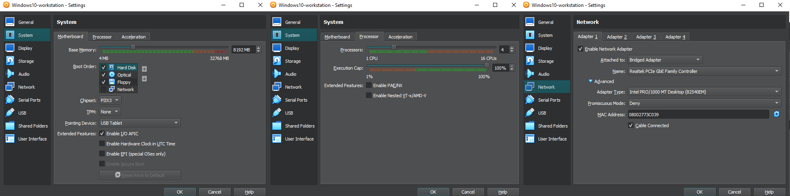

# Windows 10 – Internal Workstation Setup

## ⚙️ Configuration Summary:
- OS: Windows 10 Pro x64
- Username: `j.doe`
- Hostname: `Windows10-workstation.j.doe.virtualbox.org`
- RAM: 8192 MB (8 GB)
- CPU: 4 cores
- Disk: 50 GB (dynamically allocated)
- Chipset: PIIX3
- EFI: Disabled
- Guest Additions: Installed (VBoxGuestAdditions.iso)

## 🌐 Network:
- Adapter Type: Intel PRO/1000 MT Desktop
- Attached to: **Bridged Adapter** (Realtek PCIe GbE)
- Promiscuous Mode: Deny
- MAC Address: `08002773C039`

## 📷 Screenshot:

## 💭 Notes:
This workstation simulates an internal employee machine used for daily tasks.  
User `j.doe` represents a standard domain user. The machine will serve multiple purposes:
- Logging point for user activity via Splunk Forwarder
- Pivot point during exploitation stage (via EternalBlue)
- Intermediate access to internal Debian database

Currently using **Bridged Adapter** for setup phase — will be reconfigured to Host-only to simulate internal LAN.
