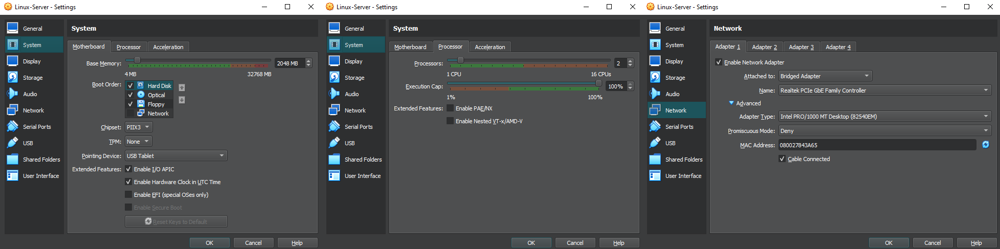

# Debian Server – Internal Database Host Setup

## ⚙️ Configuration Summary:
- OS: Debian 11 (latest stable)
- RAM: 2048 MB
- CPU: 2 cores
- Network Adapter: **Bridged Adapter** (Realtek PCIe GbE Family Controller)
- Adapter Type: Intel PRO/1000 MT Desktop
- Disk: 30 GB VDI (dynamically allocated)
- Chipset: PIIX3
- EFI: Enabled
- PAE/NX: Enabled

## 📷 Screenshot:

## 💭 Notes:
This machine will act as the internal database server storing sensitive data.  
It is accessible only from the internal LAN — no internet connectivity allowed.  
Bridged mode is temporarily used for package installation and system updates — will be reconfigured later to Host-only once the lab network is fully set up.
