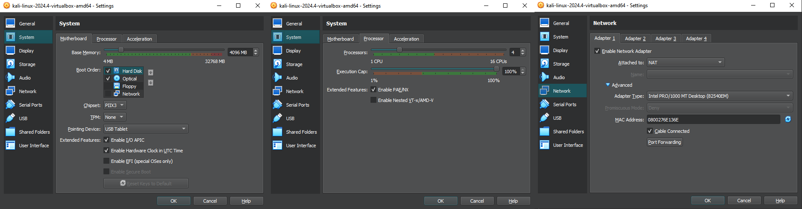

# Kali Linux – Attacker Machine Setup

## ⚙️ Configuration Summary:
- OS: Kali Linux (2024.4)
- RAM: 4096 MB
- CPU: 1 core
- Network Adapter: NAT (for external access)
- Disk: 40 GB VDI (dynamically allocated)
- Adapter Type: Intel PRO/1000 MT Desktop

## 📷 Screenshot:

## 💭 Notes:
Used NAT for internet access. Will simulate external attacker later via restricted routes.
